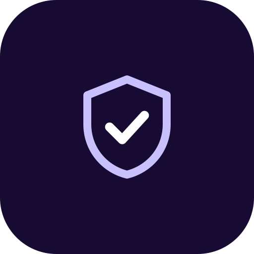
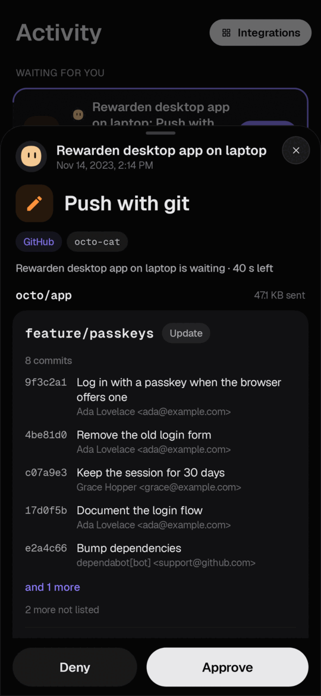
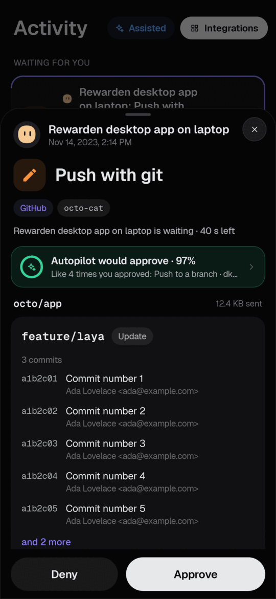
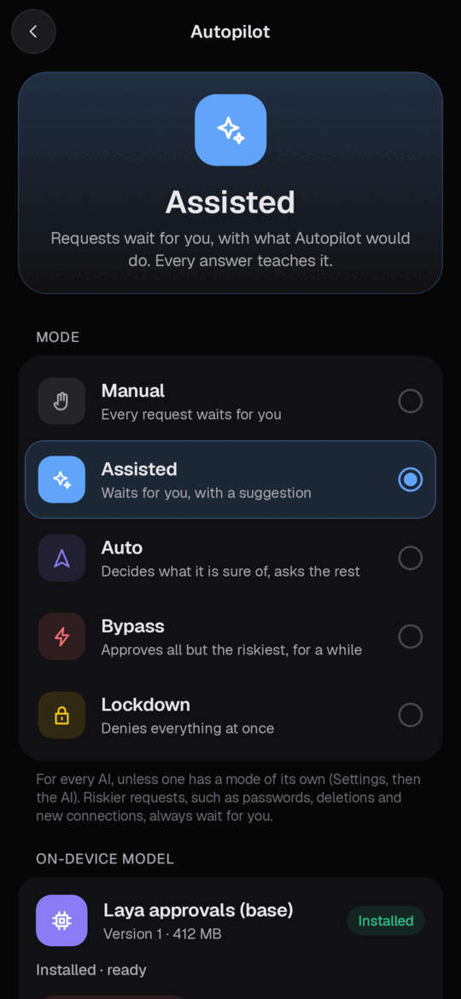
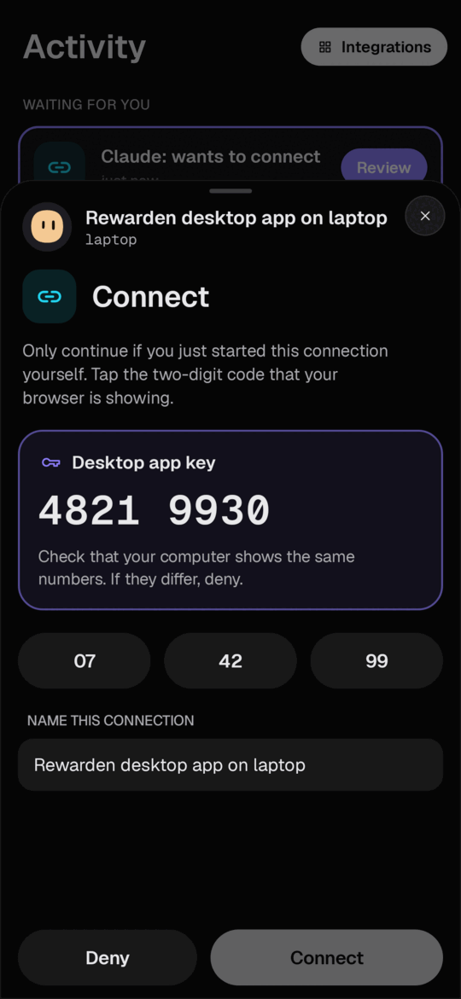
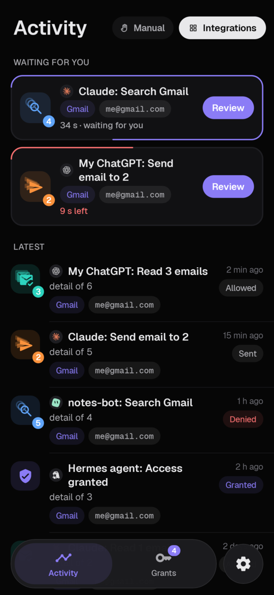
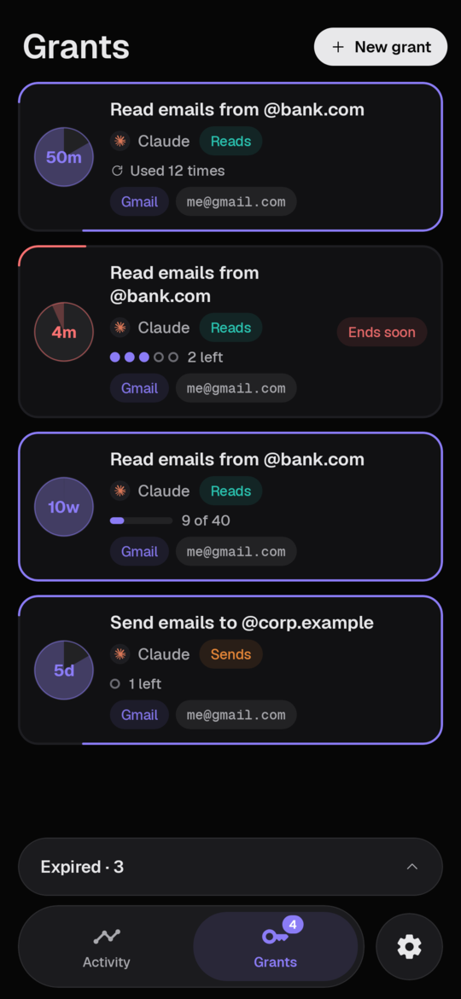
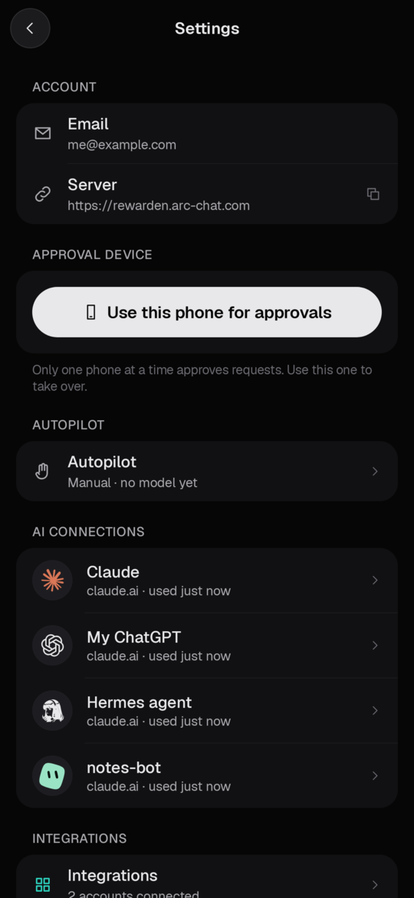
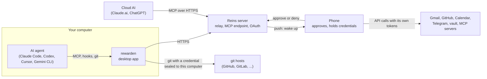

<p align="center"></p>

<h1 align="center">Reins</h1>

[](https://github.com/katulevskiy/reins/actions/workflows/ci.yml)
[](https://github.com/katulevskiy/reins/releases/latest)
[](LICENSING.md)
[](#project-status)

**Give your AI agents real power without handing them control of your life.**

> Reins was called Rewarden while it was being built. The commands, crates and the Android package still carry the
> `rewarden` name for now; they will be renamed in a later release.

## Why Reins

AI agents are finally useful. They write code, push it, answer email, book meetings and run commands for you. To do
that, they need access to your accounts, and today that usually means handing them everything: your GitHub token,
your inbox, your shell. One bad guess, one misread instruction or one malicious web page later, an agent can delete
your production database with `rm -rf`, force-push over a week of work, or send an email you never meant to send.

An AI can't be held responsible for that. You can, so you should be the one deciding.

Reins puts you back in charge. Your agents keep their power, but you hold the reins:

- **Nothing important happens without your OK.** Every action that matters shows up on your phone first, exactly as it
  will happen: the email with its recipients and text, the commits that will be pushed, the command that will run. One
  tap approves it, one tap stops it.
- **Agents never get your keys.** Passwords and tokens stay on your phone. The phone does the work and hands the agent
  only the result, so there is nothing for an agent to leak or misuse later.
- **It doesn't nag you.** Allow routine things for a while ("read my email for the next hour"), and let Autopilot, a
  small model that runs on your phone, learn which requests you always approve and which you never would.
- **You can always see what happened.** Every request, approval and denial is in your activity log.

## What's in it

| Part | What it does |
| --- | --- |
| **Phone app** (Android, iPhone and iPad) | Your remote control. Shows each request, approves or denies it, keeps your passwords and tokens, and does the actual work: sends the email, calls GitHub, reads the calendar. |
| **Desktop app** (`rewarden`) | Sits between the AI agents on your computer and the outside world: it stops risky commands until you approve them, and lets `git push` reach GitHub without the agent ever seeing your token. Works with Claude Code, Codex, Cursor and Gemini CLI. |
| **Server** | A small relay that carries requests from agents (including Claude.ai and ChatGPT in the browser) to your phone and the answers back. It never stores your credentials. Use the hosted one or [run your own](docs/self-hosting.md). |
| **Autopilot** (optional) | An AI model that runs entirely on your phone and learns your decisions. It approves what you'd clearly approve, blocks what you'd clearly block, and asks you about everything else. Risky things (passwords, deletions, new connections) always wait for you. |

In short: the agent asks, your phone shows you exactly what will happen, you decide, and the phone does it with keys the
agent never sees.

<p align="center">
  
  
  
  
</p>
<p align="center">
  
  
  
</p>

## How it works, in detail



1. An agent asks for something: an MCP tool call (`gmail_send`, `github_pr_merge`, ...), a `git push`, or a risky shell
   command caught by a harness hook.
2. The request goes to the Reins server, which holds it in memory and wakes your phone.
3. The phone shows what would happen. Requests covered by a standing permission you gave earlier run without asking.
4. When you approve, the phone performs the call with its own credentials and returns only the result. For git, the
   phone instead seals a short-lived credential to the desktop app's key; git talks to the host directly and the agent
   never sees the token.

## Quick start

You need an Android phone or an iPhone and an account on a Reins server (the hosted one or [your own](docs/self-hosting.md)).

1. **Phone.** Install the app from <https://reins2fa.com/app> and sign in with your email and master password. The
   phone becomes your approval device. Connect services under **Integrations**.
2. **Desktop app** (Linux or macOS; macOS is alpha):
   ```sh
   curl -fsSL https://reins2fa.com/install.sh | sh
   rewarden login     # compare the key shown here with the one on your phone
   rewarden resume    # start the background service; send GitHub git through it
   ```
3. **Connect your agent:**
   ```sh
   rewarden harness add claude-code    # or codex, gemini, cursor
   ```
   Restart the harness. It now has Reins's tools, and risky commands wait for your phone.

Cloud AIs connect without the desktop app: add `https://app.reins2fa.com/mcp` as a custom connector in Claude.ai
or ChatGPT. The full walkthrough is in [docs/quick-start.md](docs/quick-start.md).

## Features

**Approvals on the phone**
- One-time approvals, or standing permissions limited by target, time and number of uses.
- Previews of exactly what runs: full emails, git pushes (commits, files, line counts, force pushes), MCP arguments,
  attached files.
- Approving needs the phone's screen lock or biometrics. Activity log on the phone.
- Vault secrets an AI asks to see, destructive changes and history rewrites are asked every time. They cannot be
  covered by a standing permission.

**Connectors** (run on the phone)
- Gmail (several accounts), Google Calendar, Google Contacts.
- GitHub: about 200 tools (repositories, files, branches, issues, pull requests, releases, Actions, settings, security
  alerts, gists), plus generic `github_api_read` / `github_api_write`.
- The phone's own calendar, contacts and SMS. Telegram, as your own account.
- The password vault of your account: items, folders, attachments, Sends, the generator.
- Any remote MCP server you add on the phone. The phone is the MCP client, so its tokens stay on the phone.
- Large files go through one-time upload and download links that the phone controls.

**Desktop app** (`rewarden`)
- Git proxy for GitHub (and GitLab, Codeberg, Bitbucket when enabled). The agent never holds a git token. Each push
  is analysed from the bytes git sends, and the approval is bound to that exact push.
- Harness hooks that send risky commands and secret files to your phone (force pushes, `rm -r`, `terraform apply`,
  `.env`, private keys, ...).
- `rewarden ask`: a yes/no question to your phone from any script.
- `rewarden run`: start a program with API keys released from your vault for that run.
- Local API proxy that adds a vault key to requests. SSH agent whose private keys stay on the phone.
- `rewarden mcp`: a stdio MCP bridge for local harnesses. `pause`/`resume`, signed self-update.
- Without a phone, a local policy with desktop prompts decides about git instead.

**Autopilot** (optional, on the phone)
- Modes: Manual, Assisted (suggestions only), Auto, Bypass (time-boxed), Lockdown.
- A small model (Laya, about 370 MB) runs on the phone. It learns from your own decisions in per-profile memory.
- A hard floor that is never automatic. Text written by the AI can only make it more cautious.
- See [docs/autopilot.md](docs/autopilot.md).

## Supported harnesses

| Harness | MCP server | Hook | Set up with |
|---|---|---|---|
| Claude Code | `~/.claude.json` | `PreToolUse` on Bash, Edit, Write, MultiEdit, NotebookEdit, Read | `rewarden harness add claude-code` |
| Codex | `~/.codex/config.toml` | `PreToolUse` on Bash, apply_patch | `rewarden harness add codex` |
| Gemini CLI | `~/.gemini/settings.json` | `BeforeTool` on shell, file write/replace/read | `rewarden harness add gemini` |
| Cursor | `~/.cursor/mcp.json` | `beforeShellExecution`, `beforeReadFile`, `preToolUse` (Write, Delete) | `rewarden harness add cursor` |
| Claude.ai, ChatGPT | custom connector `https://<server>/mcp` | none | in the app's connector settings |

Details, the guard rules and how to undo everything: [docs/harnesses.md](docs/harnesses.md).

## Security model in brief

- **Credentials stay on the phone.** Gmail, GitHub, Telegram, vault and MCP server tokens are stored encrypted on the
  phone. The server never stores them. One exception: for files too large to pass through a tool call, and for MCP tools
  with very large results, the phone has the server make that one HTTP request with the needed header. The server does
  not keep or log the header.
- **The agent never holds a git token.** The phone seals a short-lived credential to the desktop app's X25519 key. You
  compare that key's fingerprint on the phone and the computer when you pair. The server relays the sealed credential
  but cannot open it. A push credential is bound to the exact push you approved.
- **The server is a relay.** It sees tool arguments and results while they pass through (the AI receives the results
  over the same channel). It keeps them in memory for at most 10 minutes, and keeps large files on disk for at most an
  hour. It stores accounts, AI connections, hashed refresh tokens and a push token.
- **Hooks are guard rails, not a sandbox.** They catch mistakes and obvious risky commands. The hard boundary is that
  the agent has no credentials.
- **Autopilot cannot be talked into approving.** Its approve score is the lower of two passes, one over the facts
  alone and one including the AI's text.

Full threat model: [docs/security-model.md](docs/security-model.md). Report vulnerabilities as described in
[SECURITY.md](SECURITY.md).

## Self-hosting

The server is a single Rust binary (a fork of Vaultwarden) with SQLite, MySQL or PostgreSQL. Set
`REWARDEN_ENABLED=true` and a public `DOMAIN`, and add a Firebase service account for push. One instance per
deployment, because relay state is in memory. See [docs/self-hosting.md](docs/self-hosting.md).

## Autopilot: what it can and cannot do

Autopilot reads a short text description of each request and answers approve, deny or ask. On held-out synthetic tests
it made no unsafe automatic approvals. It decided about a quarter to a half of requests on its own and asked about the
rest. Those numbers come from **synthetic data**. Wording that no one has tested yet may behave differently. Assisted
mode, which only suggests, is the default once you install the model. Auto mode unlocks one kind of request at a time,
and only after it has agreed with you often enough. Model card: [tools/laya/MODEL_CARD.md](tools/laya/MODEL_CARD.md).

## Project status

**Alpha.** Expect rough edges, and breaking changes between releases.

- Phone: Android (Android 12 or later) and iOS / iPadOS 26 or later (iPhone, iPad, iPhone Duo; build it from
  [`ios/`](ios/README.md), no App Store release yet). iOS has no text messages integration: apps cannot read SMS there.
- Desktop app: Linux (x86_64 and aarch64) and macOS (Apple silicon and Intel), both through the install script. macOS
  is newer: built and tested on CI, not yet field-tested end to end on a real Mac, and without two Linux protections
  (git shows no "waiting for approval" notice; no shielding from same-user debuggers). See the
  [desktop app README](crates/rewarden-desktop/README.md#macos-alpha). Windows is not supported.
- Gmail and Google Calendar/Contacts use Google scopes that need Google's app verification before the general public
  can use them.
- Push notifications need an app build that matches the server's Firebase project. With a self-hosted server and the
  published APK, requests arrive only while the app is open.

## Building from source

```sh
git clone https://github.com/katulevskiy/reins
cd reins
cargo build --release --features sqlite --bin vaultwarden   # the server
cargo build --release -p rewarden-desktop                   # the desktop app (target/release/rewarden)
```

The Android app builds with Gradle from `android/`; the iOS app with Xcode from `ios/` ([ios/README.md](ios/README.md)). [CONTRIBUTING.md](CONTRIBUTING.md) has the full build and test
commands; [docs/self-hosting.md](docs/self-hosting.md) covers running the server, including with Docker.

## Documentation

[docs/README.md](docs/README.md) lists every page: quick start, harnesses, self-hosting, security model, Autopilot,
architecture.

## License

Reins uses two licenses:

- **Apache-2.0** (the default, [LICENSE](LICENSE)): the phone app and its core, the desktop app, the protocol, the
  policy engine, the model tooling and the Autopilot model.
- **AGPL-3.0** ([LICENSE-AGPL](LICENSE-AGPL)): the server, a fork of Vaultwarden.

[LICENSING.md](LICENSING.md) lists which license applies to each part.

## Credits

- [Vaultwarden](https://github.com/dani-garcia/vaultwarden): the server is a fork. Account, vault and sign-in all come
  from it.
- [Laya](https://huggingface.co/convaiinnovations/laya) by Convai Innovations, built on
  [mmBERT](https://huggingface.co/jhu-clsp/mmBERT-base) (JHU CLSP): the base of the Autopilot model.
- Sound design from Zeron.
- Bitwarden, whose client API and web vault the server stays compatible with. Reins is not affiliated with
  Bitwarden, Inc.
