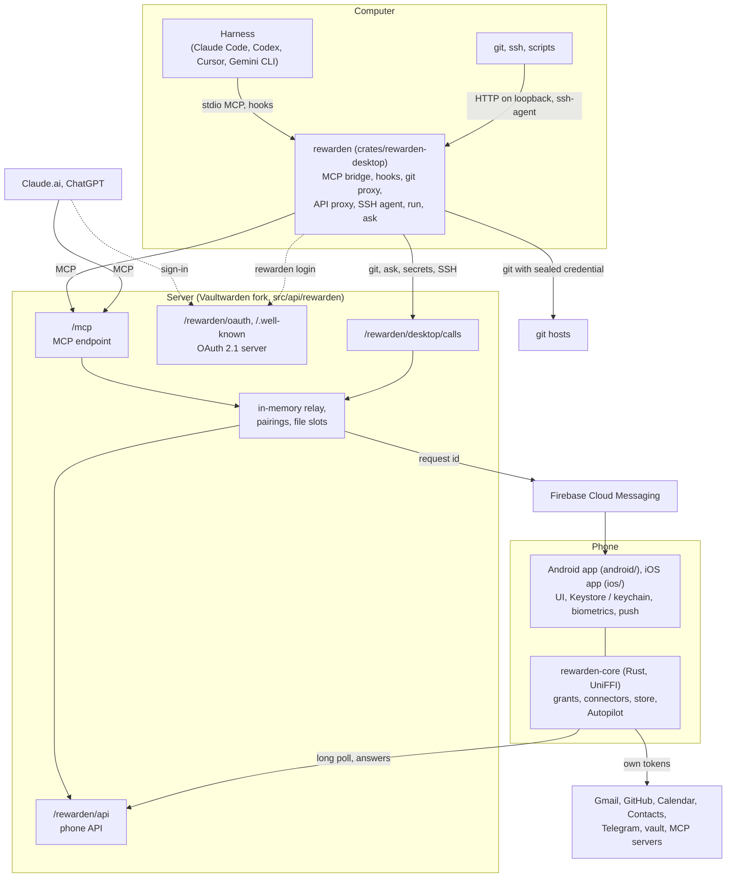
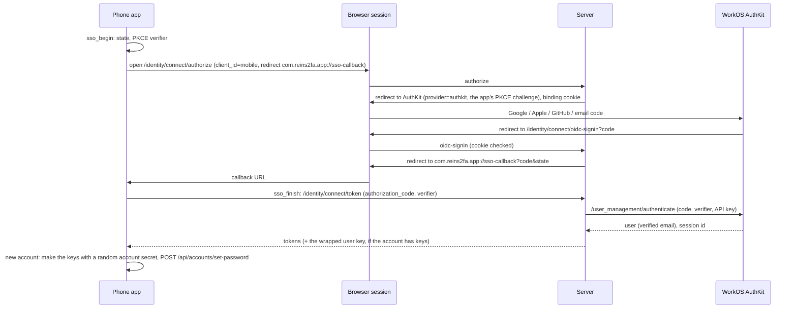
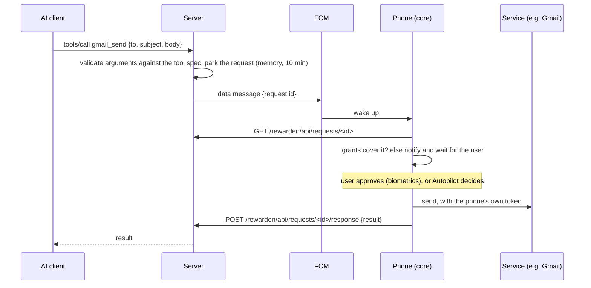
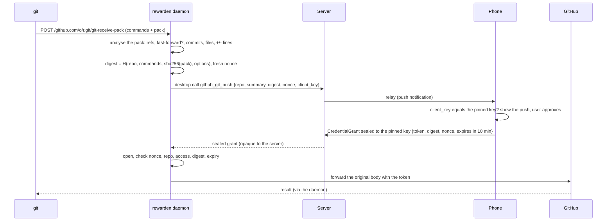

# Architecture

Reins has three parts that run on different machines. The phone decides and holds the credentials. The server
relays. The desktop app is the local hub for agents on a computer.

## Components

| Component | Where | Language | What it does |
|---|---|---|---|
| Server | `src/` (Vaultwarden fork), Reins code in `src/api/rewarden/` | Rust (Rocket, Diesel) | Accounts and vault (Vaultwarden), MCP endpoint, OAuth 2.1 authorization server, relay, phone API, desktop API, file slots, FCM and APNs senders |
| Protocol | `crates/rewarden-proto` | Rust, no IO | Wire types shared by server, phone and desktop: tool specs and argument validation, relay requests and results, pairing, desktop tools, sealed payloads, file slots, MCP server reports |
| Policy | `crates/rewarden-policy` | Rust, no IO | Grants and their evaluation: scopes, patterns, expiry, uses |
| Phone core | `crates/rewarden-core` | Rust, exported to Kotlin with UniFFI | Request handling, connectors (Gmail, Google, GitHub, git hosts, Telegram, device data, vault, remote MCP, desktop tools), encrypted SQLite store, audit log, Autopilot |
| Android app | `android/` | Kotlin, Jetpack Compose | UI, Android Keystore (wraps the core's data key), biometrics, Google Play services tokens, FCM, WorkManager, ONNX Runtime for Autopilot |
| iOS app | `ios/` | Swift, SwiftUI | UI, keychain (wraps the core's data key), Face ID, Google OAuth tokens, APNs and a notification service extension, widgets and Live Activities, ONNX Runtime for Autopilot |
| Desktop app | `crates/rewarden-desktop` | Rust | The `rewarden` CLI and daemon |
| Model runtime for tools | `crates/rewarden-laya` | Rust (`ort`) | Runs the Autopilot model on desktop CPUs for tests and `laya-try`. Not part of the phone. |
| Model tooling | `tools/laya` | Python | Synthetic data, fine-tuning, ONNX export, evaluation |
| End-to-end tests | `crates/rewarden-e2e` | Rust | Real server + real phone core + desktop app, with fake services |

## Server endpoints

| Path | Who calls it | Auth |
|---|---|---|
| `POST /mcp` | AI clients, `rewarden mcp` | OAuth bearer token (1 h JWT) |
| `/.well-known/oauth-authorization-server`, `/.well-known/oauth-protected-resource[/mcp]` | AI clients | none |
| `/rewarden/oauth/register`, `/authorize`, `/token` | AI clients, `rewarden login` | PKCE S256; public clients (dynamic registration or client ID metadata document) |
| `POST /rewarden/oauth/device_authorization` | `rewarden login` (QR code) | public clients; RFC 8628, polled at `/token` |
| `GET /pair?code=` | a phone that scanned a computer's QR code without the app | none; opens the app or offers it |
| `/.well-known/apple-app-site-association`, `/.well-known/assetlinks.json` | iOS, Android | none; pairing links open the app (`REWARDEN_APPLE_TEAM_ID`, `REWARDEN_ANDROID_CERT_SHA256`) |
| `POST /rewarden/desktop/calls`, `GET /rewarden/desktop/calls/<id>` | desktop app | the same OAuth token as MCP; only desktop-only tools |
| `/rewarden/api/*` (`device`, `pending`, `requests`, `pairings`, `pairings/claim`, `connections`, `services`, `blobs`, `mcp/call`) | the phone | Vaultwarden login token, and the caller must be the account's approval device |
| `POST /rewarden/api/joins`, `GET /rewarden/api/joins/<id>` | a phone of the account that cannot open its keys | Vaultwarden login token (any device of the account but the approval device) |
| `GET /rewarden/api/joins/<id>`, `POST /rewarden/api/joins/<id>/response` | the approval device | as the rest of `/rewarden/api/*` |
| `PUT`/`POST`/`GET /rewarden/blob/<secret>` | whoever holds the link (AI, curl) | the unguessable link itself, single-purpose, expiring |
| `/identity/connect/authorize`, `/identity/connect/oidc-signin`, `/identity/connect/token` (`authorization_code`) | the phone apps' "Continue", through the browser | SSO (WorkOS AuthKit on the hosted server), PKCE S256 end to end |
| `POST /rewarden/workos/webhook` | WorkOS | `WorkOS-Signature` (HMAC-SHA256); only wakes the WorkOS sync |

Persistent tables: `rewarden_devices` (the approval device and its push token), `rewarden_clients` (registered OAuth
clients), `rewarden_connections` (authorized AIs and desktop apps), `rewarden_refresh_tokens` (SHA-256 hashed),
`rewarden_sso_sessions` (the WorkOS session each device signed in with), `rewarden_settings` (the WorkOS events
cursor). Everything else is in memory with a time limit, so there is one server process per deployment.

## Flows

### Signing in without a password

A second phone finds the keys locked and gets the secret from the approval device ("Add another phone": an X25519 key,
a six-digit code compared on both screens, the secret sealed to the key and relayed by the server) or from the recovery
code. Either is also what lets it take the approval role from the first phone: the server wants that approval, or the
master password hash of the secret, before another device approves
([security-model.md](security-model.md#which-device-approves)). The server follows WorkOS in the background
(`src/api/rewarden/workos_sync.rs`): verified email changes, deleted users, revoked sessions. See
[security-model.md](security-model.md#accounts-without-a-master-password).

### A tool call from an AI

If the phone has not fetched the request within `REWARDEN_OFFLINE_SECS`, the AI is told the device is offline. If
nobody decided within `REWARDEN_RELAY_WAIT_SECS`, it is told to call `rewarden_get_result` later. The request stays
answerable for 10 minutes, and a late answer is kept for `rewarden_get_result`.

For reads, the phone runs the search itself and checks each result against the grants. The AI's query is only a
prefilter, so query syntax cannot widen what a grant allows.

### Pairing an AI or the desktop app

1. The client registers (dynamic registration, or a client ID metadata document URL) and opens
   `/rewarden/oauth/authorize` with PKCE. The desktop app adds `rewarden_client_key=<X25519 public key>`.
2. The user enters their email. The page shows a two-digit code (and the desktop key's fingerprint). The phone gets a
   pairing request.
3. The user taps the matching code among three, names the connection, and confirms with biometrics. For the desktop
   app, the phone pins the key to the new connection.
4. The page redirects with an authorization code. The client exchanges it for an access token (1 h) and a rotating
   refresh token (30 days).

`rewarden login` pairs without a browser by default (OAuth device authorization, RFC 8628):

1. The app asks `/rewarden/oauth/device_authorization` for a code, with its key. It shows a QR code of
   `https://<server>/pair?code=BCDF-GHJK`, the code itself, a two-digit number and its key's fingerprint.
2. The phone scans the QR code (the camera opens the link in the app; the app's own scanner reads it), and claims the
   code (`POST /rewarden/api/pairings/claim`). That starts an ordinary pairing for the phone's account, with the
   computer's number among the three choices.
3. The user taps that number, compares the key and confirms with biometrics, as above. The phone pins the key.
4. The app polls `/rewarden/oauth/token` (grant type `urn:ietf:params:oauth:grant-type:device_code`) and gets the same
   tokens. Codes live 10 minutes, in memory.

### A git push through the desktop app

A clone or fetch first tries without credentials, since public repositories need no approval. Then it asks for a read
credential, which is valid for 1 hour and cached per repository. A refused push is answered in git's own protocol, so
git prints `! [remote rejected] main -> main (...)`. Pack data flows between the computer and the git host only. The
phone sees only the summary.

### Other desktop tools

`rewarden ask` (`desktop_ask`), `rewarden run` and the API proxy (`vault_secret_release`), and the SSH agent
(`vault_ssh_keys`, `vault_ssh_sign`) use the same path. Each answer is sealed to the pinned key and echoes the
request's nonce. GitLab, Codeberg and Bitbucket use `<service>_git_fetch`, `_push` and `_tag_push`. Their pushes are
analysed from the pack alone, without the host's API.

### Large files

A tool result over 256 KiB, or a file an AI needs to pass to a tool, goes through a file slot on the server:

- **AI to tool:** the phone opens an upload slot and answers with an upload link (`curl -T file <link>`). When the file
  arrives, the phone shows its name, size, type and a preview. If you approve, the phone has the server send it to its
  destination (GitHub) or downloads it to encrypt it into the vault.
- **Service to AI:** the phone has the server fetch the large result (or uploads what it produced itself) and gives
  the AI a download link.

Slots hold at most 1 GiB per file. Each file is deleted when its operation is done, or within an hour at the latest.

### Remote MCP servers

You add MCP servers on the phone. The phone is the MCP client, and their tokens stay on it. The phone reports each
server's id, name and tool list to the server, which lists them to AIs as `<server>__<tool>`. A call is relayed to
the phone like any other. Tools the server marks read-only are reads, and all others are writes. Destructive tools
are asked every time. When a tool's results are very large, later calls to it go through the server
(`/rewarden/api/mcp/call`), so large items can be replaced with download links.

### Autopilot

After the core parks a new request, it runs Autopilot's pass: mode, hard floor, then (Assisted or Auto) the model on
two views of the situation, memory, adapter, gates, decision. It approves or denies through the same code the user's
taps use, or attaches a suggestion and notifies the user. See [autopilot.md](autopilot.md).

## Design documents

The design specs under `docs/superpowers/specs/` record the detailed contracts and the reasoning behind them:

- `2026-09-28-rewarden-mvp-design.md`: the server, relay, OAuth, phone core and policy.
- `2026-09-29-rewarden-contracts.md`: wire contracts.
- `2026-09-30-desktop-git-proxy.md`: the desktop app and git.
- `2026-09-30-github-vault-tools.md`: the GitHub and vault tools.
- `2026-10-01-files-mcp-daemon.md`: large files, remote MCP, and the desktop app's other parts.
- `2026-10-01-autopilot-laya.md`: Autopilot.
- `2026-10-02-passwordless-sign-in.md`: sign-in through WorkOS AuthKit, the keyless vault, another phone, the WorkOS
  sync.
