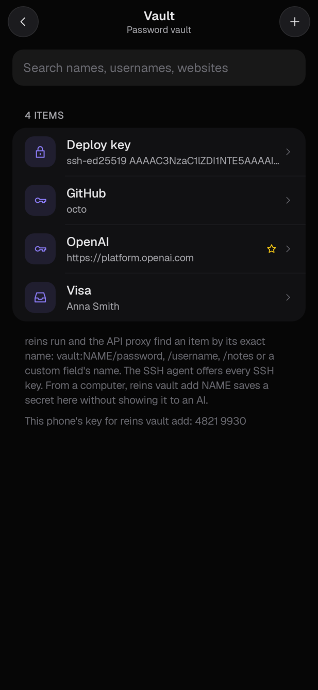
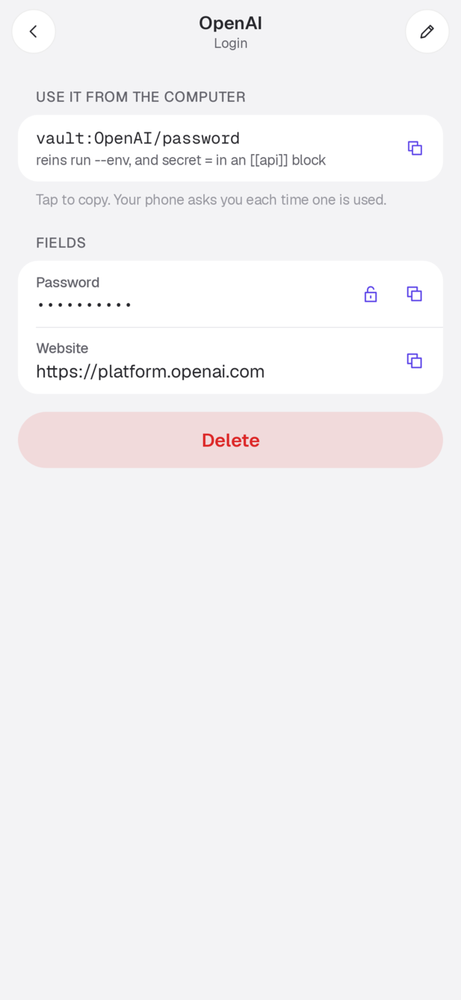
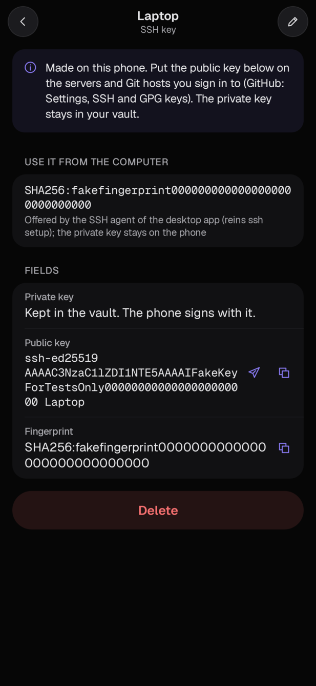

# Quick start

This guide takes you from nothing to an agent whose actions wait for your phone. The apps use the hosted server,
`https://app.reins2fa.com`, unless you tell them otherwise. If you run your own, see [self-hosting](self-hosting.md) for
pointing them at it.

You need:

- an Android phone (Android 12 or later), or an iPhone or iPad with iOS 26 or later (no App Store build yet: build the
  app from [`ios/`](../ios/README.md));
- for the desktop app, a Linux computer (x86_64 or aarch64), a Mac (Apple silicon or Intel) or a Windows 10 or 11
  computer (x86_64; Arm when the release has a build for it).

## 1. Install the phone app and create an account

1. On the phone, open <https://reins2fa.com/app> and install the APK (Android asks you to allow installs from your
   browser once). The app updates itself from the same place.
2. Tap **Continue** and sign in, or sign up, with your email address on the sign-in page. There is no password: the
   first time, the phone makes your account and the keys of its vault by itself and keeps them. It then offers to
   protect the vault with a passkey and shows your **recovery code**, the code that opens the vault if you lose the
   phone: write it down (**Settings → Account → Recovery code** shows it again later). A short tour follows:
   notifications, integrations, Autopilot, your computer and your AI app; each step can be skipped. **Use another
   server** is for your own server, which may also offer a master password instead.
3. Signing in makes this phone your **approval device**. Only one phone per account is the approval device. On a
   second phone, **Continue** finds the account's keys on the first one: tap **Ask my other phone**, check that both
   show the same six digits, and approve on the first phone (or enter the recovery code). The new phone then takes
   over the role, and the old one is told it was replaced. **Use this phone for approvals** in the settings moves it
   back. Signing in alone never moves the role: a phone without your other phone's yes or the recovery code is told
   "This account already has a phone for approvals" ([why](security-model.md#which-device-approves)).
4. Allow notifications. Requests arrive as notifications, even when the app is closed.

The app supports authenticator-app (TOTP) two-factor login. Other second factors are not supported by the app yet.

## 2. Connect services on the phone

Go to **Activity → Integrations**. Each service is connected on the phone and its credentials stay there:

| Service | How it connects |
|---|---|
| Gmail, Google Calendar, Google Contacts | Android's account picker, then Google's consent screen. Several Google accounts can be added. |
| GitHub | A personal access token you create on GitHub. The app opens the page with the settings filled in and picks the token up from the clipboard. |
| GitLab, Codeberg, Bitbucket | A token, for git through the desktop app. |
| Telegram | Your own account: phone number, code, and 2-step password if you have one. |
| Phone calendar, contacts, SMS | Android permissions, asked when you connect each one. |
| Password vault | Nothing to enter for an account made with **Continue**. Otherwise your master password, entered once. The phone keeps the vault key sealed, not the password. |
| Other MCP servers | Add the server's URL. The app signs in with OAuth or a token you give it. |

## 3a. Connect a cloud AI (Claude.ai, ChatGPT)

- **Claude.ai**: Settings → Connectors → Add custom connector, URL `https://app.reins2fa.com/mcp`.
- **ChatGPT**: Settings → Connectors (developer mode), same URL.

A browser page asks for your account email and shows a two-digit code. Your phone shows three codes. Tap the one that
matches, give the connection a name, and confirm. From then on that AI has Reins's tools for the services you
connected, and each call waits for your phone unless a standing permission covers it.

## 3b. Install the desktop app

```sh
curl -fsSL https://reins2fa.com/install.sh | sh
```

It works on Linux and macOS. The script downloads the build for your computer, checks its SHA-256, and installs
`reins` to `~/.local/bin` (set `REINS_INSTALL_DIR` to change that). Later updates: `reins update`. It installs
only releases signed with the release key built into the program.

Run in a terminal, the script then finishes the setup: it pairs with your phone unless this computer is paired already
(the steps below), adds Reins to every AI harness it finds (`reins harness add --all`) and starts the background
service with git going through it (`reins resume`). `REINS_NO_SETUP=1` skips that. On a computer with a screen
it first offers the **Reins app** instead, which does the same with a window: a QR code to scan with your phone, a
checklist of your AI tools, and afterwards a shield in the menu bar (macOS) or tray (Windows, Linux) with Pause and
Resume. The app is also a download of its own: `Reins-macOS.dmg`, `Reins-Windows-x64.msi` or
`Reins-Linux-x86_64.AppImage` from the [latest release](https://github.com/katulevskiy/reins/releases/latest).
On macOS, Homebrew installs it too: `brew install --cask katulevskiy/tap/reins` (the app, and the `reins` command
that comes with it).

On Debian and Ubuntu, Fedora and Arch Linux, Reins also comes as packages, which the system keeps up to date: `reins`
(the command-line program) and `reins-app` (the app) from signed APT and RPM repositories, and `reins-bin` on the
AUR. For Debian and Ubuntu:

```sh
sudo install -d -m 0755 /etc/apt/keyrings
curl -fsSL https://reins2fa.com/releases/packages/reins.gpg | sudo tee /etc/apt/keyrings/reins.gpg > /dev/null
echo "deb [signed-by=/etc/apt/keyrings/reins.gpg] https://reins2fa.com/releases/packages/apt stable main" |
    sudo tee /etc/apt/sources.list.d/reins.list
sudo apt update && sudo apt install reins reins-app
```

For Fedora: `sudo curl -fsSL https://reins2fa.com/releases/packages/rpm/reins.repo -o /etc/yum.repos.d/reins.repo`,
then `sudo dnf install reins reins-app`. The details, the `.sources` form and Arch Linux are in
[Linux packages](linux-packages.md). The packages install no service by themselves; `reins resume` sets it up as
below.

On a Mac, `~/.local/bin` is usually not on your `PATH`; the script prints the line to add to `~/.zshrc`. macOS support
is alpha: built and tested on GitHub's macOS runners, not yet field-tested end to end on a real Mac. Two things differ
from Linux: git does not print "waiting for approval on your phone" while a push or clone waits (it just waits), and
the daemon's memory is not shielded from debuggers running as you. See the
[desktop app README](../crates/reins-desktop/README.md#macos-alpha).

Or download it from the [latest GitHub release](https://github.com/katulevskiy/reins/releases/latest): the
`reins-desktop-<version>-<target>.tar.gz` archive for your computer (`x86_64-unknown-linux-musl`,
`aarch64-unknown-linux-musl`, `aarch64-apple-darwin` for Apple silicon, `x86_64-apple-darwin` for Intel Macs), checked
against `SHA256SUMS`. Unpack it and put `reins` on your `PATH`, for example in `~/.local/bin`. On a Mac, an archive
downloaded with a browser is quarantined and Gatekeeper refuses the unsigned program; clear the flag with
`xattr -d com.apple.quarantine reins` (`curl` downloads, like the install script's, are not quarantined).

On Windows, in PowerShell (no administrator needed):

```powershell
irm https://reins2fa.com/install.ps1 | iex
```

The script downloads the latest GitHub release's `reins-desktop-<version>-x86_64-pc-windows-msvc.zip` (or
`aarch64-pc-windows-msvc` on Arm), checks it against the release's `SHA256SUMS`, installs `reins.exe` to
`%LOCALAPPDATA%\Programs\Reins` (set `REINS_INSTALL_DIR` to change that) and adds that folder to your user `PATH`.
Open a new terminal afterwards. `$env:REINS_VERSION = "v0.2.0"` before it installs that release instead of the
latest. Later updates: `reins update` (from the same signed release feed as on Linux and macOS) or the script
again. You can also
unpack the zip yourself and put `reins.exe` anywhere on your `PATH`. Windows support is alpha: built and tested on
GitHub's Windows runners, not yet field-tested end to end on a real PC; see the
[desktop app README](../crates/reins-desktop/README.md#windows-alpha) for what differs.

All of the setup in one command (it pairs, starts the background service, sends git through Reins and connects every
AI tool it finds, then sums up what it did):

```sh
reins setup
reins test      # a harmless question on your phone: approve or deny it to see the whole loop
reins doctor    # checks everything, with a fix for each problem
```

Or step by step. Pair it with your phone:

```sh
reins login
```

It pairs with the hosted server; for your own, add its address (`reins login https://reins.example.com`). The
terminal shows a QR code. Scan it with the phone's camera, or in the app (**Settings → Connect a computer**; without a
camera, type the code printed under it). The phone shows three numbers: tap the one the terminal shows. The terminal
also prints the app's key, for example `4821 9930`, and the phone shows the same digits in a **Desktop app key** card.
**Approve only if the digits match.** On approval the phone pins this key to the connection. From then on only this
computer can open the credentials the phone sends it. `reins login --browser` signs in through a browser page
instead (enter your email there; `--no-browser` prints the link instead of opening it).

Start the background service and send git through it:

```sh
reins resume     # installs the background service if needed (systemd user unit, launchd agent on a Mac, or
                    # on Windows an entry in your Run key), then routes github.com remotes through it
reins status     # version, who decides, server, key, pending local approvals, git routing
```

On Windows the background service is a windowless copy of `reins.exe` in `%LOCALAPPDATA%\reins`, started at
once and at every logon from `HKCU\Software\Microsoft\Windows\CurrentVersion\Run` (Task Manager lists it under
Startup apps as `reins-daemon.exe`). Its log is `%LOCALAPPDATA%\reins\daemon.log`. Unlike systemd it is not
restarted when it stops; `reins status` says so and `reins resume` starts it again.

`reins resume` adds `url.<proxy>.insteadOf` rules to your global git config. `https://github.com/...`,
`git@github.com:...` and `ssh://git@github.com/...` remotes then go to the daemon at `http://127.0.0.1:7457/github.com/`.
`reins pause` removes exactly those rules, and git talks to GitHub directly again. To route only one repository:
`reins git setup --repo DIR` (undo with `reins git unsetup --repo DIR`).

Try it: clone a private repository or push a branch. Your phone shows the repository, the branch, the commits and the
changed files. Approve, then run the git command again if git stopped waiting. The daemon keeps git waiting up to
`approval_timeout_secs` (120 s by default).

## 4. Connect a local agent

```sh
reins harness add claude-code      # or: codex, gemini, cursor; --all for every one found on this computer
```

This registers `reins mcp` as an MCP server and `reins hook` as the harness's pre-tool hook. Restart the
harness. For Codex, also trust the new hook once with `/hooks`. See [harnesses.md](harnesses.md) for what is
written where and how to undo it.

Now ask the agent to do something with a connected service ("list my open pull requests"), or to run a command the
guard watches (`git push --force`). The request appears on your phone. If it does not, see
[troubleshooting](troubleshooting.md).

## 5. Answer requests quickly

Most requests take one tap:

- **From the notification.** Routine requests (a search, reading a calendar, a fast-forward push, a hook's question)
  have **Approve** and **Deny** buttons. Approve works once the phone is unlocked. It approves exactly what the
  request's screen would approve without changes; anything that looks like a code or a password is never included.
  Requests that are asked every time (below) have no buttons: tap the notification to open them.
- **On the request's screen.** The first line says what approving does ("Claude gets the 3 emails found for
  "from:bank"."). **Approve and allow for 1 hour** approves and lets the same AI do the same thing (the same account,
  chats, repository branch, tool or command topic) without asking for an hour. After you approve the same thing a few
  times in a day, the screen says so and offers 8 hours. The permission shows up under **Grants**, where you can end
  it.
- **Several at once.** When one AI asks for several routine things at once, **Activity** shows **Approve N** (one
  screen lock or biometric check for all of them) and **Deny all**. What needs a closer look stays in the list.

**Your starting rule.** The setup asks how a new AI should start (change it later at the end of **Grants**):

- **Let it read for a day** (recommended): when you connect an AI, it gets permissions to search and read each service
  you connected (not the vault or the desktop app) for 24 hours. They are listed under **Grants**, where you can end
  them. Sending and changing anything still ask.
- **Ask me every time**: every search and every read waits for you too.

Whatever the rule, an email or a message that looks like a login code or a password is never released by a
permission: it waits for your tick, and it is never ticked for you.

Some requests are always asked for and never have a shortcut: vault secrets an AI wants to see, destructive changes,
history rewrites (including a hook's question about a force push, a recursive delete, `reset --hard` and the like, or
about reading `.env` or a key), new connections and permission requests ([security model](security-model.md#which-device-approves)).

## More from the desktop app

### Ask a question from a script

```sh
reins ask "Deploy build 142 to production?" --detail "make deploy ENV=prod" --topic "command:make deploy"
echo $?   # 0 yes, 1 no, 2 no answer
```

When logged in, the question goes to your phone. Otherwise it is asked in the terminal or as a desktop notification.
`--detail -` reads the detail from stdin. `--topic` names what a standing answer on the phone may cover.

### Put a secret in the vault

`reins run`, the API proxy and the SSH agent use items of the password vault on your phone, found by name. Add them
in either of two ways; neither shows the value to an AI.

**On the phone:** Integrations → Password vault → **Open the vault** → **+**. Pick **API key** (kept as the password
of a login), **SSH key**, Login, Secure note, Card or Identity. Each item's page shows what to write on the computer,
such as `vault:OpenAI/password`, and shows or copies a secret only after your screen lock. **SSH key** → **Make a new
key on this phone** makes an Ed25519 key and shows its public half to copy or share (put it on the server, or in
GitHub → Settings → SSH and GPG keys); the private key stays in the vault and is never shown.

<p>
  
  
  
</p>

**From the computer:**

```sh
reins vault add OpenAI                          # asks for the value without echo; saved as vault:OpenAI/password
pbpaste | reins vault add Groq                  # or piped in
reins vault add Stripe --kind note              # vault:Stripe/notes
reins vault add AWS --field "Secret key"        # a custom field (hidden): vault:AWS/Secret key
reins vault add deploy --kind ssh < ~/.ssh/id_ed25519
reins vault add OpenAI --replace                # change an item that exists; its earlier value is kept
reins vault list                                # the items' names, never a value (asked on the phone each time)
```

The value is encrypted on this computer so that only your phone can open it, and the phone asks "Save a new API key
OpenAI in your vault?" before keeping it. The terminal prints four check digits (`Check: 4821`) and the phone shows
the same ones: approve only if they match, so that a value an AI sent in your place does not pass for yours. An item
that already has that name is changed only with `--replace`; a login's earlier password goes to its password history,
anything else to a hidden field such as "Notes before 2026-10-09". An SSH key is never replaced: add the new one
under another name.

The first time, the phone hands the computer its key: approve it, note the twelve digits the phone shows (also at the
bottom of the Vault page, written like `4821-9930-1274`), and type them in the
terminal. They are not the eight digits of the computer's own key that `reins status` shows. After a new phone, or
installing Reins again, `reins vault add` says the phone could not open the value; run it with `--new-phone` to check
the new phone's key the same way.

### Run a program with secrets from the vault

```sh
reins run --env OPENAI_API_KEY=vault:OpenAI/password --purpose "eval run" -- python eval.py
```

The phone shows the command, the purpose and the item and field names (never the values). When you approve, the
values are released sealed to this computer and set as environment variables for that one command, then wiped from
`reins`'s memory. Fields: `password`, `username`, `totp` (the current code), `notes`, `uri`, or a custom field's
name. The item is named by its id or exact name ([put a secret in the vault](#put-a-secret-in-the-vault)).

Named sets go in `~/.config/reins/config.toml` (on Windows `%APPDATA%\reins\config.toml`):

```toml
[run.profiles.openai]
env = { OPENAI_API_KEY = "vault:OpenAI/password" }
purpose = "OpenAI scripts"
```

```sh
reins run --profile openai -- python script.py
```

`reins run` exits with the command's own exit code. It exits with 125 when the secrets were not released. On
Windows a bare name also finds `.cmd` and `.bat` programs (`reins run ... -- npm test` runs `npm.cmd`).

### Call an API without handing out its key

```toml
[[api]]
name = "openai"
base = "https://api.openai.com"
secret = "vault:OpenAI/password"
# header = "Authorization: Bearer {secret}"   (the default)
# lease_secs = 3600                           (60 to 86400)
```

`reins vault add OpenAI` puts the key there. The agent calls `http://127.0.0.1:7457/api/openai/v1/models` with no key. The daemon asks the phone for the secret once
per lease, adds the header, and forwards the request.

### SSH with keys that stay on the phone

```sh
reins ssh setup     # adds an IdentityAgent block to ~/.ssh/config (reins ssh unsetup removes it)
reins ssh status
```

The daemon runs an SSH agent whose identities are the SSH key items in your vault (make one on the phone: [put a
secret in the vault](#put-a-secret-in-the-vault)). Each signature is made on the phone after you approve it. The phone shows the key and the server you are connecting to.

On Windows the agent is a named pipe (`\\.\pipe\reins-ssh-agent-...`, `reins ssh status` shows it), and
`reins ssh setup` points Windows' own OpenSSH (`C:\Windows\System32\OpenSSH\ssh.exe`) at it through
`%USERPROFILE%\.ssh\config`. Git for Windows brings its own ssh, which cannot use the pipe; for git over SSH set
`git config --global core.sshCommand C:/Windows/System32/OpenSSH/ssh.exe` (git through `reins resume` uses HTTPS
and needs no agent). Tools that read `SSH_AUTH_SOCK` instead can be given the pipe's name.

### Without a phone: local mode

When the desktop app is not logged in, git requests are decided by a local policy. The default policy allows reads,
and asks about pushes and risky pushes. The questions appear as desktop notifications (a dialog on macOS, a Yes/No
message box on Windows), or you answer them with
`reins pending`, `reins approve <id>`, `reins deny <id>`. The GitHub token comes from `gh auth token` by
default (`[github] token = "env:NAME"` or `"file:PATH"` to change that). Local mode protects against an agent's
mistakes, not against a hostile agent (see [security-model.md](security-model.md)).

## Undo everything

```sh
reins uninstall            # every step below, and ends this computer's connection on the server
reins uninstall --purge    # also deletes this computer's key, the activity log and config.toml
rm ~/.local/bin/reins
```

`reins uninstall` does, one by one (and says how each went):

```sh
reins harness remove claude-code   # each harness you added
reins ssh unsetup
reins pause                        # git talks to the hosts directly again
reins service uninstall
reins logout                       # also removes this computer from the phone's list (on an up-to-date server)
```

On Windows the last step is deleting `%LOCALAPPDATA%\Programs\Reins` and taking it out of your user `PATH` (Settings →
System → About → Advanced system settings → Environment Variables).

Settings live in `~/.config/reins/` and state (the app's key, the session) in `~/.local/state/reins/` (on
Windows `%APPDATA%\reins\` and `%LOCALAPPDATA%\reins\`). Delete both to forget everything (`reins uninstall --purge` does). With an older server, `reins logout` only forgets the session here: remove the connection on the phone under Settings to revoke the computer's access.
