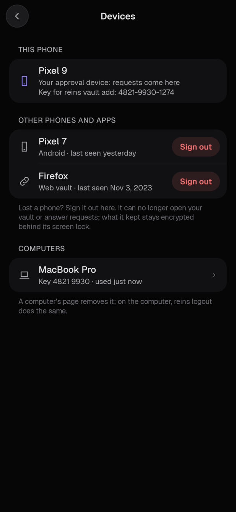

# Troubleshooting

Start with `reins status` on the computer: it says whether the background service runs, whether the computer is paired
with your phone, where git goes and which AI tools Reins is added to, and the command that fixes each missing piece.

## A request never shows up on the phone

- **The computer is not paired.** `reins status` says `Server: not logged in`: run `reins login` and scan the code with
  the phone. Until then the computer decides by itself (desktop notifications, `reins pending`).
- **The background service is not running.** `reins status` says `Daemon: not running`: run `reins resume`.
- **This phone is not the approval device.** Settings → Approval device on the phone. Only one phone per account gets
  requests; **Use this phone for approvals** moves the role here.
- **Notifications are off.** Requests arrive as notifications even when the app is closed. Allow them in Android's
  settings for Reins (Activity shows a card when they are off).
- **No push.** A self-hosted server without Firebase, or a phone without Google Play services, gets requests only
  while the Reins app is open. Keep it open while you work, or set up push ([self-hosting](self-hosting.md)).
- **The AI tool was not restarted.** `reins harness add` changes the tool's settings; the tool reads them when it
  starts. `reins harness list` shows what is set up.
- **Codex runs only hooks you trusted.** After `reins harness add codex`, open Codex and trust the new hook once with
  `/hooks`. Until then risky commands are not sent to your phone.

## The phone says "Set a screen lock or fingerprint on this phone to approve"

Approving needs the phone's screen lock or biometrics. Set a PIN, pattern, password or fingerprint in the phone's
settings (Security), then approve again.

## git push fails

- `GitHub is not connected in Reins yet`: since `reins resume`, git to GitHub goes through Reins, and Reins pushes
  with the GitHub token kept on your phone. Connect GitHub in the app (Integrations → GitHub), or run `reins pause`
  to send git straight to GitHub again.
- git stopped waiting: the computer waits for your answer for `approval_timeout_secs` (120 s by default, in
  `~/.config/reins/config.toml`). Approve on the phone, then run the git command again.

## Claude.ai or ChatGPT does not connect

Add `https://app.reins2fa.com/mcp` (or your server's address followed by `/mcp`) as a custom connector, enter the email
of your Reins account on the page that opens, and tap the number the page shows on your phone. If no request arrives,
check the email address on that page; then see [A request never shows up](#a-request-never-shows-up-on-the-phone).

## Adding an MCP server says "No MCP server answers at that address"

The address is a web page, not the MCP endpoint. Copy the address from the service's MCP instructions; it usually ends
in `/mcp` (some older servers use `/sse`).

## Signing in on a self-hosted server shows "No browser sign-in on this server"

Your server has no SSO set up. Close the page and, in the app, use **Sign in** or **Create account** with an email
address and a master password.

## "This account already has a phone for approvals"

You signed in on a new phone. The vault and the approval role stay with the first phone until you prove it is you:
**Unlock with passkey** (if you added one), **Ask my other phone** (approve on the old phone; both show the same six
digits), or **Enter recovery code**.

## I lost my phone

1. Install Reins on the new phone and sign in to the same account.
2. Open the vault with **Unlock with passkey**, or **Enter recovery code**. The new phone becomes the approval
   device: requests come to it, and the lost phone no longer gets any. The computers and AI apps you connected stay
   connected to the account.
3. On the new phone, **Settings → Devices** lists every device signed in to the account. Tap **Sign out** next to the
   lost phone (the dialog shows its platform, when it signed in and when it was last seen, in case two phones share a
   name), and type your recovery code (or master password) to confirm. Its sign-in ends at once and its WorkOS
   session with it: the app on it can no longer open your vault, sync or answer requests, and signing in again from
   it as it is gets refused, saying which phone signed it out and when. If WorkOS cannot be reached, nothing is
   signed out yet and the phone says to try again. (Only the approval phone can sign others out, which is why step 2
   comes first.)
4. What signing out does not stop: whoever has the lost phone and its screen lock can open Reins' Settings on it,
   read your recovery code, install Reins again (a fresh install is a new device), sign in to your account if they
   can (the email inbox, Google account or passkeys on that phone), and take the approval role back with the code.
   So also, from another device: sign the lost phone out of the accounts you sign in to Reins with (Google account →
   Security → Your devices; your email provider's sessions) and remove passkeys it holds. If it may be in the wrong
   hands, the safe way out today is **Reset the vault** on the new phone after copying what you need out of it:
   changing the recovery code is not possible yet. The integrations' tokens on it are a separate risk: revoke them at
   the source (GitHub's personal access tokens, Google account → Security → third-party access, Telegram → Devices)
   and connect them again on the new phone.
5. `reins vault add` on your computers asks for the new phone's key the first time (type the twelve digits it shows).

**Someone signed your phone out?** The sign-in screen says which phone did it and when. A phone that has your account
secret (another phone you added) can take the approval role and sign yours out. Install Reins again on your phone (or
clear its data), sign in, open the vault with your passkey or recovery code to take the role back, then sign the other
phone out in Settings → Devices with your recovery code. If it keeps happening, that phone has your recovery code:
reset the vault.

Lost the phone, the recovery code and every passkey? **Lost both? Reset the vault** on the new phone starts the
account over with an empty vault: saved items, integrations and their grants are deleted, and your AIs and computers
must be connected again.

## `reins run` says "No vault item matches"

Name the item by its id or its exact name, and the field after a slash: `vault:OpenAI/password`. Fields are
`password`, `username`, `totp`, `notes`, `uri` or a custom field's name. `reins vault list` shows the names, and the
item's page in the Reins app (Integrations → Password vault → Open the vault) shows what to write. Not there yet?
`reins vault add OpenAI` adds it, or **+** on that page. Two items with the same name cannot be told apart: rename one.
